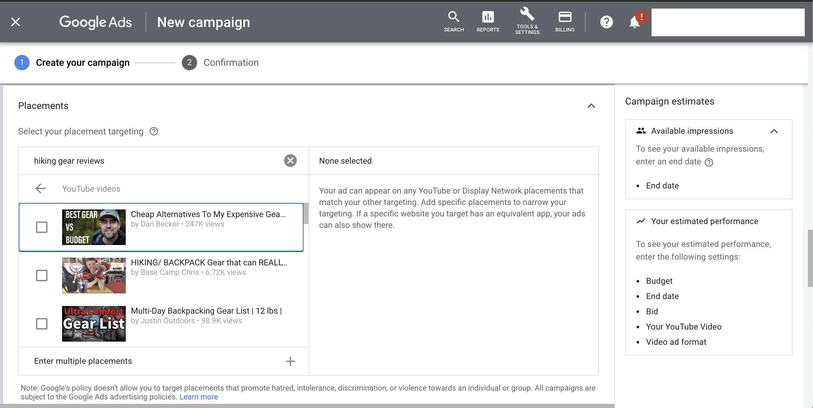

# YouTube Ad Placements
This repository contains code and data to reproduce our investigation of YouTube ad placements.

Data that we collected and analyzed are in the `data` folder.

Jupyter notebooks used for data collection, preprocessing and analysis are in the `notebooks` folder.


<i> Advertisers can use Google's ad portal to search for YouTube videos and channels related to keywords like: "hiking gear reviews" to advertise on.</i>
<br>

## Installation
### Python
Make sure you have Python 3.6+ installed, we used [Miniconda](https://docs.conda.io/en/latest/miniconda.html) to create a Python 3.8 virtual environment.

Then install the Python packages:<br>
`pip install -r requirements.txt`

## Notebooks
These notebooks are intended to be run sequentially, but they are not dependent on one another.

### 0-data-collection.ipynb
How we interacted with the "PlacementSuggestionService" API from "ads.google.com". We sent each term from `terms.py` through the API. Use this notebook for reference: it is not functional due to the expired or redacted parameters present.

### 1-data-preprocessing.ipynb
Parsing the API responses and fetching the suggested videos and channels for each term we sent to the API.

### 2-data-analysis-hate.ipynb
The bulk of stats and tables for our hate methodology.

### 3-suggestion-analysis.ipynb
Looks at videos and channels suggested by the API for `hate` terms. We cross reference these suggestions with channels that a report published by the [ADL](https://www.adl.org/resources/reports/exposure-to-alternative-extremist-content-on-youtube) identified as "extremist" or "alternative", as well as a channels another report by researchers at [EPFL and UFMG](https://dl.acm.org/doi/abs/10.1145/3351095.3372879) identified as "alt-right" or "alt-lite". See the channel lists in `data/input/channel_lists`

### 4-data-analysis-social-justice.ipynb
The bulk of stats and tables for our social justice methodology.

### terms.py
This contains lists of terms used in the series. This includes `hate` terms sourced from the SPLC, RationalWiki.org, and Muslim Advocates. `social_justice` terms sourced from Color of Change, MediaJustice, Mijente, and Muslim Advocates. `adhoc` terms were submitted for comparison against terms in the other lists. `noise` contains randomly generated strings.

Refer to the "Data" section below for the API status of each of these terms.

## Data
This directory is where inputs, intermediaries and outputs are saved.
```
data
├─── reference
│   ├── placements_api_example_responses
│   │   ├── blocked.json
│   │   ├── empty.json
│   │   ├── full.json
│   │   └── partially_blocked.json
│   └── what_is_blocked.xlsx
├── input
│   ├── channel_lists
│   ├── hate_terms_additional_info.csv
│   ├── placements_api
│   │   ├── adhoc
│   │   ├── blocked
│   │   ├── blocked_basewords
│   │   ├── hate
│   │   ├── noise
│   │   ├── policy
│   │   └── social_justice
│   ├── placements_api_deep3
│   │   ├── we wuz kangz.json
│   │   ├── white ethnostate.json
│   │   └── whitegenocide.json
│   └── video_metadata
│       ├── deep_catalog_wwk_wg_we.csv
│       └── topline_hate_videos.csv
└── output
    ├── channel_overlap.csv
    ├── tables
    ├── placements_api_keyword_status
    │   ├── adhoc.csv
    │   ├── basewords.csv
    │   ├── hate.csv
    │   ├── policy.csv
    │   └── social_justice.csv
    └── placements_api_suggestions
        ├── channels_for_hate_terms.csv
        ├── channels_for_social_justice_terms.csv
        ├── videos_for_hate_terms.csv
        └── videos_for_social_justice_terms.csv
```

| filename or directory                                       | description                                                                                                                                                                                                                                                                                                                                                       |
|:------------------------------------------------------------|:------------------------------------------------------------------------------------------------------------------------------------------------------------------------------------------------------------------------------------------------------------------------------------------------------------------------------------------------------------------|
| `data/reference/placement_api_example_responses/`           | Examples of `blocked`, `partially_blocked`, `full` and `empty` responses from the "PlacementSuggestionService" API.                                                                                                                                                                                                                                               |
| `data/reference/what_is_blocked.xlsx`                       | A spreadsheet with the kind of API responses for all the terms in our investigation.                                                                                                                                                                                                                                                                              |
| `data/output/tables/`                                       | CSVs of tables that are in the methodology.                                                                                                                                                                                                                                                                                                                       |
| `data/input/placements_api/`                                | This contains responses for keywords from `notebooks/terms.py` that we submitted to the "PlacementSuggestionService" API. Each sub-directory is used to organize by the keyword list used. `blocked` are terms that we resubmitted after removing spaces, and `blocked_basewords` are terms that were blocked and resubmitted word-by-word.                       |
| `data/output/placements_api_keyword_status/`                | Contains the API status of keywords from `notebooks/terms.py` after being sent through the "PlacementSuggestionService" API.                                                                                                                                                                                                                                      |
| `data/output/placements_api_suggestions/`                   | The suggested YouTube videos and channels for each search term.                                                                                                                                                                                                                                                                                                   |
| `data/input/placements_api_deep3/`                          | API responses for the `hate` terms "we wuz kangz", "white ethnostate" and "white genocide" beyond the topline 20 video suggestions.                                                                                                                                                                                                                               |
| `data/input/video_metadata/`                                | Video metadata for suggested videos from the YouTube Data API (v3). Collected with the unofficial Python client ([YouTube Data API](https://youtube-data-api.readthedocs.io/en/latest/))                                                                                                                                                                          |
| `data/input/channel_lists/`                                 | Contains channel names and IDs that researchers at [EPFL and UFMG](https://dl.acm.org/doi/abs/10.1145/3351095.3372879) identified as "alt-right" and "alt-lite", as well as channels that a report published by the [ADL identified](https://www.adl.org/resources/reports/exposure-to-alternative-extremist-content-on-youtube) as "extremist" or "alternative." |
| `data/output/adl_extremist_alternative_channel_overlap.csv` | The count of unique "extremist" and "alternative" videos and channels from the topline suggestions for `hate` terms we sent through the "PlacementSuggestionService" API. We included the channels that were suggested in the `channels` column.                                                                                                                  |
| `data/input/hate_terms_additional_info.csv`                 | Links for more information about each of the terms in the `hate` list.                                                                                                                                                                                                                                                                                            |